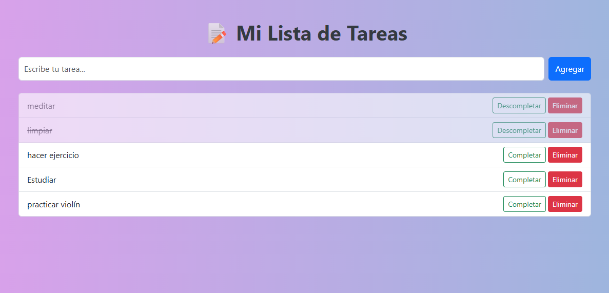

# Aplicación ToDo Flask 

Aplicación web simple para gestionar tareas, construida con **Flask**, **SQLite** y **SQLAlchemy**. Permite agregar,completar, eliminar y visualizar tareas en una interfaz sencilla.

---

## Tecnologías

- Python 3.12
- Flask
- SQLAlchemy
- HTML5 + CSS3

---

## Instalación y uso

1. Clona el repositorio:
   ```bash
   git clone https://github.com/Diani7/flask-todo-app.git
   cd flask-todo-app

## 🖼️ Vista previa




# Autora
Diana Cifuentes
Desarrolladora apasionada por la tecnología y el aprendizaje constante.